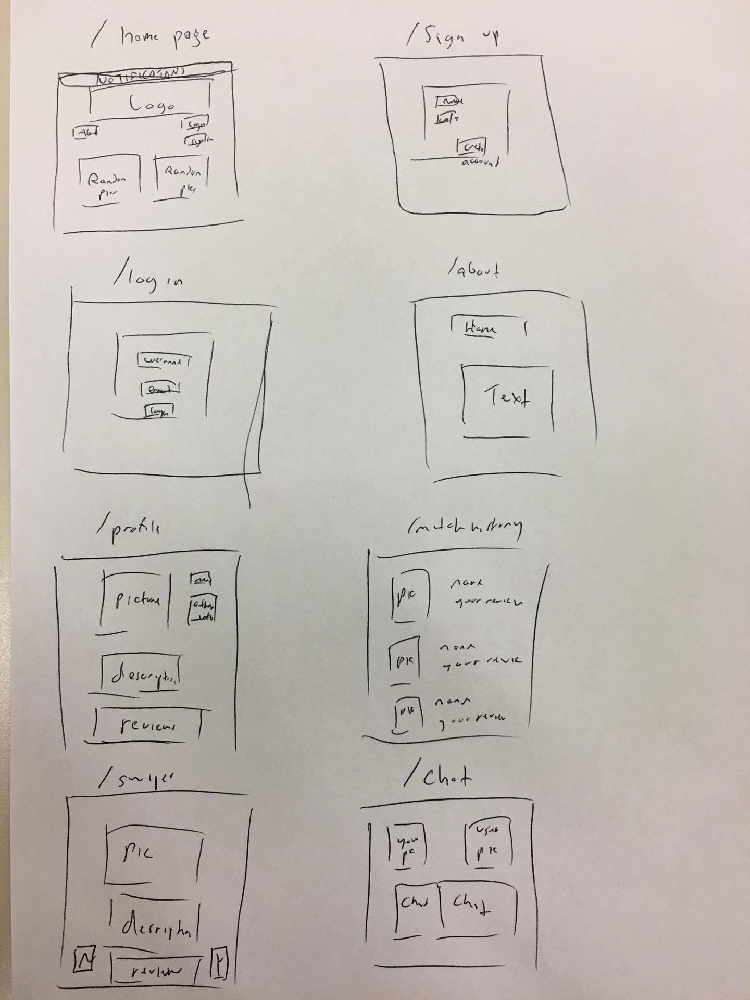

# SwipeMe  

## Overview

Do you ever feel hungry and lonely?  Well this is the perfect place for you, 2 in 1, get your meal swipes and meet the cute girl/guy of your dream with SwipeME.  Essentially this is tinder with a gauranteed free meal! 

SwipeMe is a web application that will allow users to 'swipe' right or left depending on their preferences.  "Oh she fine" or "Mmhmm he's cute" matching them with fellow NYU students. 
Each user has 2 options to identify themselves as, they can either be a 'Swiper' or a 'Needy'.  When identified as a Swiper you have an unlimited amount of people you can swipe past until you choose 3 people to match with for that day.  When you are a Needy then you can only look at a set number of people per day.  
As a Swiper because you are the one using your meal swipes they have a guarantee match with whoever they choose.  However, as a Needy its just the waiting game for you buddy.  
## Data Model

The application will store Users, Matches and Reviews of the people (Comments) 

* users can have multiple matches (by embedding)
* users can have multiple reviews about them as well (by embedding) 
* users can comment about multiple people (by embedding) 

An Example User:

```javascript
{
  username: "SadBoi Hanjie",
  password: // a password hash,
  email: whyamIsolonelyandhungry@nyu.edu,
  hasSwipes: false,
  title: Han Jie,
  matches: // an array of other users that were matched, 
  reviews: // an array of reviews other users placed about you, 
  critiques: // an array of critiques you wrote about other users
}
//Will include an image in the future
//Will include a short description in the future 
//Will include potential ability to write a daily post/tweet
```

An Example Match Array:

```javascript
{
  username: "Why am I like this Drew",
  hasSwipes: true,
  title: "Andrew"
}
```

An Example Review Array:

```javascript
{
  username: "Why am I like this Drew",
  comments: "He is the most beautiful man I know",
  rating: 10
}
```

An Example Critique Array:

```javascript
{
  username: "Why am I like this Drew",
  comments: "He was aye",
  rating: 2
}
```

An Example User with Embedded Matches, Reviews, and Critiques:

```javascript
{
  username: "SadBoi Hanjie",
  password: // a password hash,
  email: whyamIsolonelyandhungry@nyu.edu,
  hasSwipes: false,
  title: Han Jie,
  matches: [
     { username: "Why am I like this Drew", hasSwipes: true, title: "Andrew" },
     { username: "JSON FILES", hasSwipes: false, title: "Jason" } //Because he is false, it means I was true at that time
  ], 
  reviews: [
     { username: "Why am I like this Drew", comments: "He is the most beautiful man I know", rating: 10}
  ],
  // an array of reviews other users placed about you, 
  critiques: [
     { username: "Why am I like this Drew", comments: "He was aye", rating: 2}
  ]
  // an array of critiques you wrote about other users
}
```


## [Link to Commented First Draft Schema](db.js) 

## Wireframes

This shows all page images - Sorry for the mess, they will look nicer next time and will incorporate them all



## Site map

Here's is [my sitemap](./documentation/sitemap.png)

## User Stories or Use Cases

1. As a non-registered user I can read more about the site and its purpose or I can sign up for an account
2. As a registered user I can view my profile and edit certain aspects
3. As a user I can view my reviews written by other users 
4. As a user I can view my critiques of other users 
5. As a user I can check todays matches and debating on my hasSwipes status it will react differently (My site map will reflect this in the future)
6. As a user I can make matches (my site map will reflect a chatting or appointment functionality)
  
## Research Topics

* (1 points) Integrate user authentication
    * I will be validating the persons account via email, as of now only NYU students will be allowed to make an account  
* (5 points) Integrate Google API's, such as: calendar, map, and share
    * I will use the calendar option to save the date (Will add this later on to the rest of my code) 
    * I will use the map location to ping a place for either person to meet at (unless they want to meet at the dining hall) 
    * I will implement some share function to allow this to be added to social media
* (5 points) Create google plugins
    * I will create plugins so users can recieve notifications 

11 points total out of 8 required points
 
## [Link to Initial Main Project File](app.js) 

## Annotations / References Used

(___TODO__: list any tutorials/references/etc. that you've based your code off of_)

1. [passport.js authentication docs](http://passportjs.org/docs) - (add link to source code that was based on this)
2. [tutorial on vue.js](https://vuejs.org/v2/guide/) - (add link to source code that was based on this)
